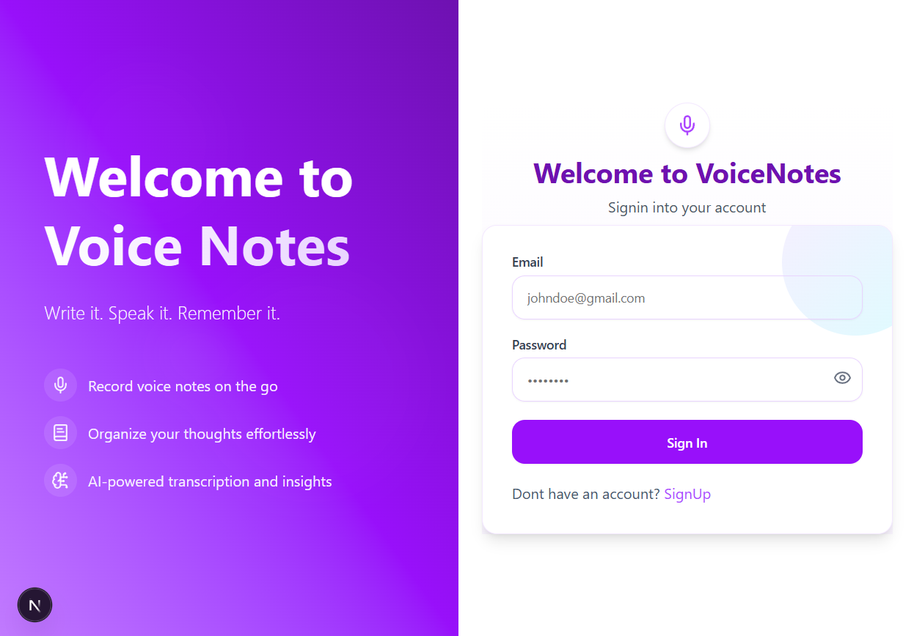
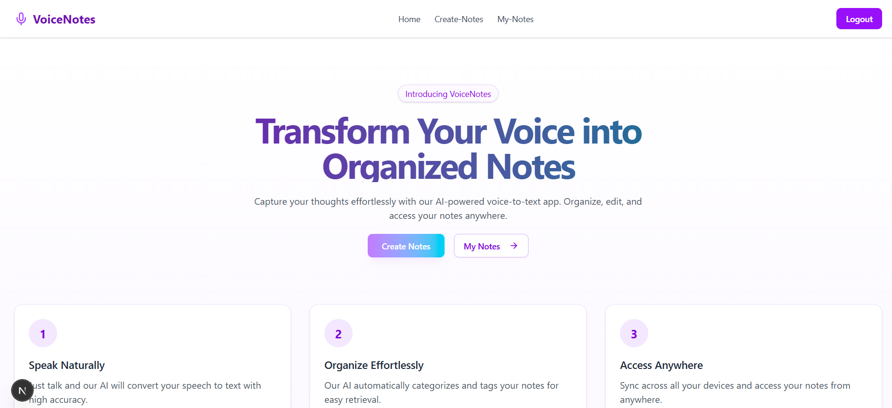
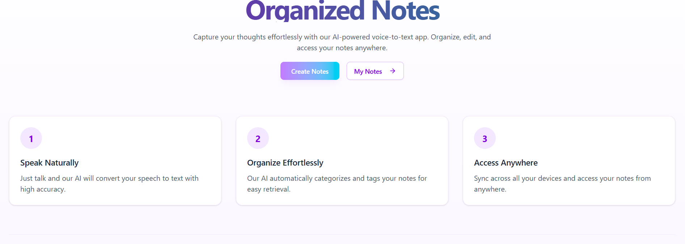
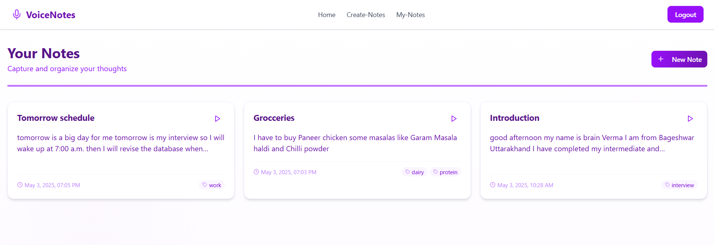

# 🎤 Voice-Notes

Voice-Notes is a lightweight, browser-based speech recognition app that converts spoken words into text in **real-time**. Built with **Next.js**, **TypeScript**, and the **Web Speech API**, it supports continuous recognition, interim result streaming, and robust error handling. Perfect for voice-enabled note-taking and hands-free interactions.

----

## 🚀 Features
- Real-time speech-to-text conversion using the Web Speech API
- Continuous recognition with interim results
- Robust error handling
- Voice-enabled note-taking
- Hands-free user interactions
- Multi-language recognition support

---

## 🛠 Tech Stack
- **Frontend:** Next.js, TypeScript, Tailwind CSS  
- **Speech Recognition:** Web Speech API  
- **Backend:** Express.js  
- **Real-time Processing:** WebSockets (optional for syncing with server)  

---

## 📦 Installation & Setup

```bash
# Clone the repository
git clone https://github.com/yourusername/voice-notes.git
cd voice-notes

# Install all dependencies
npm install 


# Start project
 npm run dev


# 📸 Screenshots
```

### Signin Page


### Home Page




### Create My-Notes Page



